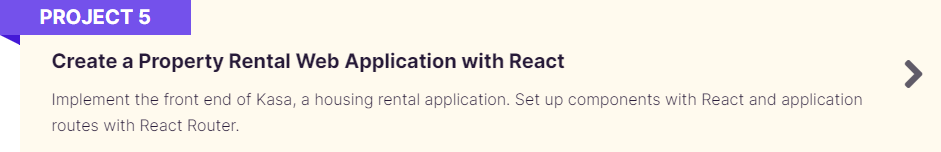

  
  
  

  
  ## Project n°5 from Openclassrooms's Web Development training program

 
 

# React + Vite
This project was bootstrapped with [Vite](https://github.com/vitejs/vite).

## Available Scripts
In the project directory, you can run:
### `yarn install`
(you can use 'npm' instead of 'yarn' depending on which package manager you're using)
### `yarn run dev`

This template provides a minimal setup to get React working in Vite with HMR and some ESLint rules.

Currently, two official plugins are available:

- [@vitejs/plugin-react](https://github.com/vitejs/vite-plugin-react/blob/main/packages/plugin-react/README.md) uses [Babel](https://babeljs.io/) for Fast Refresh
- [@vitejs/plugin-react-swc](https://github.com/vitejs/vite-plugin-react-swc) uses [SWC](https://swc.rs/) for Fast Refresh
